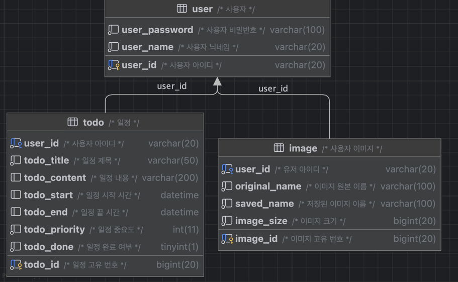

# TODO-LIST

## 📖 프로젝트 소개

- Spring boot 를 활용한 기본적인 CRUD 를 학습하고자 시작한 프로젝트입니다.
- TODO-LIST 는 회원가입을 통해서 사용자마다 개별적인 LIST 를 보유할 수 있습니다.
- 상태 반영을 통해서 완료된 일정과 미완료 일정을 확인할 수 있으며 남은 시간이 리스트에 표시됩니다.
- 일정의 제목을 통해서 완료된 일정과 미완료 일정을 검색할 수 있습니다.

---

## 🛠️ 기술 스택

### Back-end
- Language : Java17
- FrameWork : SpringBoot 3.3.0
- DataBase : MariaDB
- ORM : MyBatis

### Front-end
- Template Engine : Thymeleaf
- Library : JQuery, BootStrap

---

## ⭐️ 주요 내용
- Spring MVC 패턴을 적용해서 프로젝트를 구성했습니다.
- 회원가입 및 로그인 기능에서 Spring Security6 를 활용하여 로그인 하도록 구현했습니다.
- 로그인 시 로그인한 유저의 개별적인 LIST 를 조회할 수 있고 일정 추가, 수정, 삭제를 진행할 수 있습니다.
- 상태 반영을 통해서 완료한 일정, 미완료 일정을 필터링하여 리스트를 조회할 수 있고 페이징을 통해서 여러 개의 일정이 있을 때 여러 개의 페이지로 나누어 볼 수 있도록 했습니다.
- 제목을 통한 검색으로 해당되는 일정만 표시되도록 구현했습니다.

---

## ERD

---